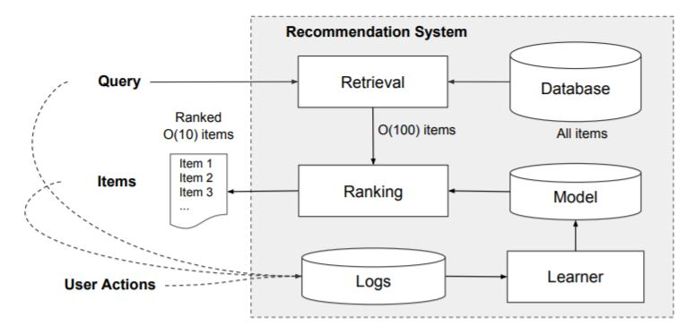
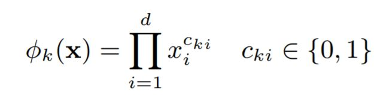
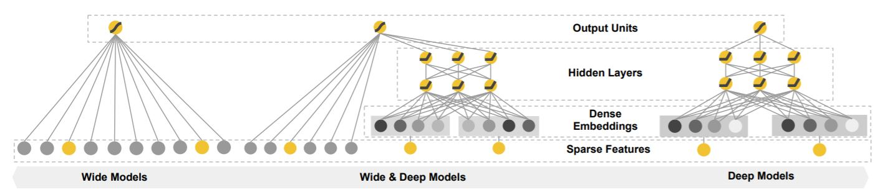
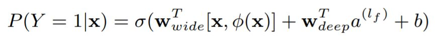
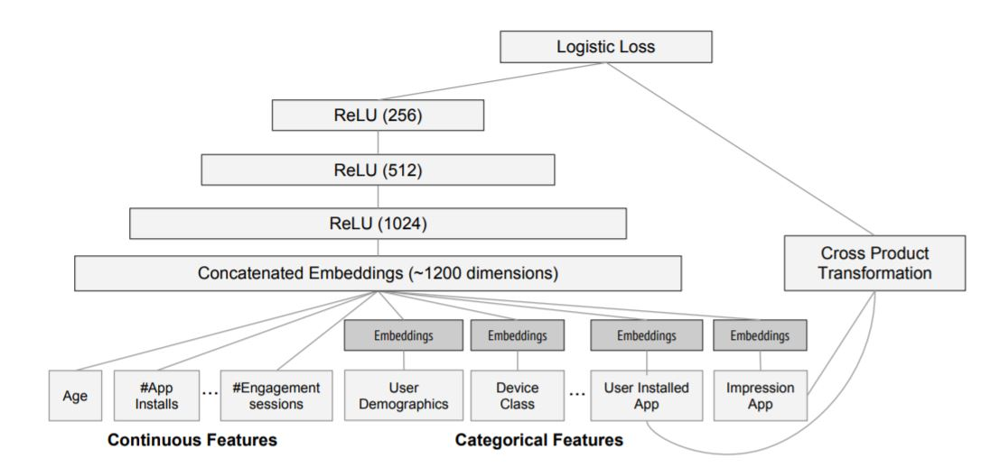

## Wide & Deep Learning (WDL)
—— Engine for Recommender System

##### Papers
* Google —— Wide & Deep Learning for Recommender Systems
* YouTube —— Deep Neural Networks for YouTube Recommendations

 

#### Part 1 —— Wide & Deep Learning for Recommender Systems

##### Abstract
* Memorization of feature interactions through a wide set of cross-product feature transformations are effective and interpretable,
  while generalization requires more feature engineering effort. （Feature Interactions 有效，但 Feature Engineering 工程量巨大）
* However, deep neural networks with embeddings can over-generalize and recommend less relevant items 
  when the user-item interactions are sparse and high-rank. （用户-项目交互稀释或太高级时，神经网络失效）

##### 笔记
模型考虑的两个方面：
* Memorization of Feature Interactions （记忆）
* Generalization (概括、泛化)
解决思路：
* Jointly trained wide linear models and deep neural networks. （WL/DL 联合训练）

##### Introduction
##### 基础概念
* Recommender System
  * Be viewed as a search ranking system, input: a set of contextual information, output: a ranked list of items.
  * 三点： 1. find the ***relevant*** items in a database. 2. ***rank*** the items based on certain ***objectives***.
* Memorization
  * learning the frequent co-occurrence（共现） of items or features and exploiting the correlation available（可用的相关性） in the historical data.
* Generalization
  * based on transitivity of correlation（相关性的可传递特性） and explores new feature combinations that have never or rarely occurred in the past.

##### 笔记
Memorization vs Generalization
* Memorization 的局限是基于用户过去（已经）执行的行为（performed actions），从其中选择。 或者热门话题（more topical）。
* Generalization 则侧重于提升推荐条目的多样性（diversity）。

##### Generalized Linear Model
* For massive-scale online recommendation and ranking systems in an industrial setting, generalized linear models such as logistic regression are widely used
  because they are simple, scalable and interpretable.
* The models are often trained on binarized sparse features with one-hot encoding. (binary feature)
* Generalization can be added by using features that are less granular（更小的颗粒）, but manual feature engineering is often required.
* One limitation of cross-product transformations is that they do not generalize to query-item feature pairs that have not appeared in the training data.

##### Embedding-based Model
* 解决 generalize to query-item feature pairs. (with less burden of feature engineering)

##### Generalized Linear Model vs Embedding-based Model
* EBM is difficult to learn effective low-dimensional representations for queries and items when the underlying query-item matrix is sparse
  and high-rank, such as users with specific preferences（偏好） or niche（小众） items with a narrow appeal（吸引力）.
* On the other hand, GLM with cross-product feature transformations can memorize these "exception rules" with much fewer parameters.

##### 笔记
广义线性模型（GLM）对特殊偏好和小众内容有较好的适应性。

##### Recommender System Overview
###### App 推荐系统概述

* 一个 query 由两部分信息： 1. usr info 用于记录用户习惯； 2. contextual informations 一段描述。
* 用户的一次访问将获得一个列表（list, also referred to as impressions）。
* 在列表上的用户活动（点击或购买）将被记录在日志中，用于学习器的训练。

##### 推荐系统的 KPI 约束
* Since there are over a million apps in the database, it is intractable（棘手） to exhaustively（详尽） score every app for every query within the serving latency requirements (often О(10) milliseconds).

##### 基于 KPI 的解决方案
* 第一步， ***retrieval*** 检索系统返回一个小的，best matched 条目列表。 （combination of machine-learned models and human-defined rules）
* 第二步， ***ranking*** 排名系统为所有的检索条目打分并排名。
* Note: The ***scores*** are usually *P*(*y*|**x**), the probability of a user action label *y* given the features **x**, including user features, contextual features, and impression features.
    * ***user features*** —— country, language, demographics, etc.
    * ***contextual features*** —— device, hour of the day, day of the week, etc.
    * ***impression features*** —— app age, historical statistics of an app, etc.

##### WDL 模型的核心关注点是 ***ranking model***。

##### 笔记
一个完整的推荐系统由三部分组成
* ***retrieval system*** —— matching
* ***ranking system*** —— scoring
* ***log system*** —— learning / feature engineering

##### WIDE & DEEP LEARNING
##### 1.1 The Wide Component
* GLM, ***y=WX+b***
* The feature set includes raw input features and ***transformed features***.
* 一个重要的转换方式是 ***cross-product transformation***.

###### cross-product transformation

* ***Cki*** 表示第 *i* 个特征是否与第 *k* 个特征相关。 0 为不相关， 1 为相关。
* 任何数的 0 次方都为 1。 0 的 1 次方为 0。
* 通过使用上式，依据 raw input features 可以更新所有特征的状态，判断其是否应该被考虑。 （GLM 的非线性部分）
* 然后依据 ***y=WX+b*** 算得 *P*(*y*|**X**)。

##### 1.2 The Deep Component
* DL 的原始输入， for categorical features, the original inputs are feature strings (e.g., "language=en")。
* 这些稀疏（sparse）、高维的特征需要转换为密集（dense）、低维的实数向量（real-valued vector, often referred to as an ***embedding vector***）。
* Note: ***The dimensionality of the embeddings are usually on the order of О(10) to О(100)***.
* DL 模型的 forward 流程为 ***Sparse Features*** -> ***Dense Embeddings (Embedding Vector)*** -> ***Hidden Layers*** -> ***Output***。

##### 1.3 Joint Training of Wide & Deep Model
* The wide component and deep component are combined using a ***weighted sum*** of their output log odds(***log(*P*)***) as the prediction, which is
  then fed to one common logistic loss function for joint training.
* ***joint training vs ensemble***
    * ensemble —— individual models are trained separately.
    * joint training —— optimizes all parameters simultaneously by taking both the wind and deep part as well as the weights of their sum.
    * ensemble 方式导致更大的模型，因为每个独立的模型需要足够精确。 （待验证，AdaBoost 方法就是使用的 weak model。）

###### Wide & Deep Learning Model

###### WDL 的逻辑斯蒂回归模型

* Φ(X) 表示特征 X 经 cross-product transformation 之后的特征。
* a^(*lf*) 表示 deep part 最后的激活值（the final activations）。 
* σ 是 sigmoid function。

##### SYSTEM IMPLEMENTATION
##### 2.1 Data Generation
* ***user*** and ***app impression*** data 获取一段时间， 用作训练数据。
* Label 是 ***app acquisition***， 如果 impressed app 被安装，则 app acquisition 为 1，否则为 0。
* Note: ***Vocabularies, which are tables mapping categorical feature strings to integer IDs, are also generated in this stage***.  
  （人为定义一些 ***categorical feature***，并且一一对应到不同的整数。）
* ***Continuous（连续的） real-valued features are normalized to \[0, 1\] by mapping a feature value x to its cumulative distribution function（累积分布函数） P(X ≤ x).***  
  （对于 ***real-valued feature***，将其映射到 \[0, 1\]。 例如： 图像中将一个点的位置映射到 0~1 的方法， x_position / image_width。）

##### 笔记
模型的 feature 类型
* Categorical Features (字符串)
* Continuous Features （实数）
* Cross-Product Transformation Features （人为定义的相关性特征集合）

##### 2.2 Model Training
###### WDL 模型结构

* Categorical features 需要首先转换为 embeddings， 一个 categorical feature 转换为多个 embeddings 的模型需要认真考虑。  
  （对于该论文， A 32-dimensional embedding vector is learned for each categorical feature。）

##### 2.3 Model Serving
* For each request, the servers receive a set of app candidates from the app retrieval system and user features to score each app.
* The scores are calculated by running a forward inference pass over the Wide & Deep model.

##### 2.4 实验
A/B 实验。 （A/B Testing.）

 

#### Part 2 —— Deep Neural Networks for YouTube Recommendations
