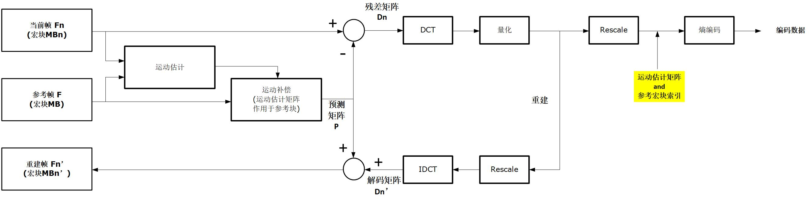
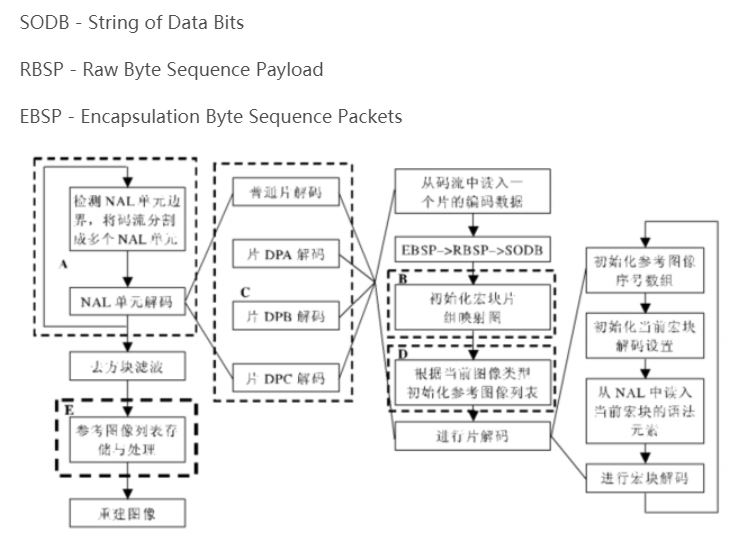

## ITU-T H.264 / MPEG-4 AVC 编解码原理

##### 前提： 视频压缩的必要性
—— 视频压缩使得人们能够更有效地使用传输和存储资源。

##### H.264 视频压缩标准
* 国际标准化组织 ISO 的 MPEG-* 系列标准
* 国际电信联盟 ITU-T 的 H.26x 系列标准

异同点：
* 编码的基本原理都是相同的，都是用空域预测去掉空间冗余、时域预测去掉时域冗余，最后采取熵编码，使得可以用最少的比特数来表示码流。
* 所不同的是，各种标准采用的具体算法和实现各不相同。

##### H.264 引入的先进技术
* 4×4 整数变换
* 空域内的帧内预测
* 1/4 像素精度的运动估计
* 多参考帧
* 多种小块的帧间预测
* 去除块效应的环路滤波
* 灵活的 slice 大小
* 基于上下文的自适应变长编码 CAVLC
* 基于上下文的自适应二进制算术编码 CABAC
* 其他等等

<br>

#### Part 1 —— JPEG 压缩原理

##### 编码过程
* 色彩空间转换
    * 由 RGB 转换为一种称为 YUV 的不同色彩空间，YUV 分量可以由 PAL 制系统中归一化（经过伽马校正）的 R,G,B 经过一定的公式计算得到。
* 缩减取样 （Downsampling）
    * 减少 U 和 V 的成分，称为 "缩减取样" 或 "色度抽样" （chroma subsampling）。
    * 在 JPEG 上这种缩减取样的比例可以是 4:4:4 （无缩减取样）， 4:2:2 （在水平方向 2 的倍数中取一个），以及最普遍的 4:2:0 （在水平和垂直方向 2 的倍数中取一个）。
* 离散余弦变换 （Discrete cosine transform， DCT） <br>
    * 每一个区域再划分成如瓷砖般排列的一个个的 8×8 子区域，每一子区域使用二维的离散余弦变换（DCT）转换到频率空间。
    * 左上角之相当大的数值称为 DC 系数（直流系数）；其他 63 个值称为 AC 系数（交流系数）。
    * 对所有 8×8 表格中的 DC 系数使用差分编码，对 AC 系数使用行程编码。
* 量化 （Quantization）
    * 这是整个过程中的主要有损运算。
    * 以结果而言，经常会把很多更高频率的成分舍位成为接近 0，且剩下很多会变成小的正或负数。
    * （注意） 量化矩阵的获取来自实验得出的经验值，好的图形图像处理软件有多种各个环境的经验值。
* 熵编码技术 （entropy coding）
    * 熵编码是无损数据压缩的一个特别形式。

特别说明: 压缩过程中存在的人为现象（不规则现象）
```
在量化阶段，依照除数的不同，会使结果的压缩比率可能有很多变化。 
  ▫ 10:1 通常可得到无法使用肉眼分辨与原图差异的影像。
  ▫ 100:1 压缩通常是可行的，但与原图相较，会看出明显的不自然痕迹。
压缩的适当等级是依据要压缩那一种影像而定。
```

##### 解码过程
—— 反向做以上所有的过程。
* 对熵编码解码。
* 取 DCT 系数矩阵。
* 在把 DC 系数差异加回去之后，以前面的量化矩阵乘以它。
* 左上角的部分与原本 DCT 系数矩阵非常接近地相似。使用反向 DCT 得到一个有数值的影像。（即解压缩的子影像 —— 8x8 区域）
* 将所有 8x8 子影像组合，获得原始图像。

refer https://zh.wikipedia.org/zh-cn/JPEG

<br>

#### Part 2 —— H.264 压缩原理
##### DPCM（Differential Pulse Code Modulation） 和 DCT 混合编解码器
##### 特别说明：
```
1. 预测编码的意思：
   经过压缩编码后传输的并不是像素本身的取样值，而是该取样的预测值和实际值之差。
2. 块效应产生原因
   原因1： 基于块的帧内和帧间预测残差的 DCT 变换系数进行量化的过程相对粗糙，（参考JPEG有损压缩）
          解码时 IDCT 恢复 AC/DC 变换系数带有误差，造成图像块边界上视觉不连续。
   原因2： 另一个次要原因来自于运动补偿预测。
```

##### 编码过程
—— 编码器有两条主要的数据流路径
* 左 -> 右 （编码）
* 右 -> 左 （重建）
<div align="center"></div>

过程如下：
* 图像区域切分
    * 以宏块（16×16 亮度区域和相应的色度区域）为单位，对输入视频第 n 帧 Fn 进行编码。
* 运动估计 （motion estimate）
    * 运动估计函数从参考帧（如上一次重建帧F或子采样后的F）中寻找当前宏块的匹配（相似）区域，该区域和当前宏块的位置偏移即为运动矢量 MV。
* 运动补偿 （motion compensate）
    * 根据运动矢量 MV 计算匹配宏块运动后的预测矩阵 P。
* 残差矩阵获得
    * 用当前宏块减去预测矩阵 P，获得残差宏块 Dn。
* 将 Dn 分割为 8×8 或 4×4 的子块，分别进行 DCT 变换
* 子块量化
* 子块的 DCT 系数重排序 (Reorder)
* 编码后的系数、运动矢量和相关的宏块头信息经过熵编码(无损）后生成压缩比特率。

注意：
```
由于量化过程不可逆，所以 Dn' 和原宏块 Dn 并不相同（有失真）。
```

解码过程：
* 熵解码器从压缩比特流中解码出变换系数、运动矢量和宏块头信息。
* 重排序之后，得到量化的变换域宏块。
* 重定比例(Rescale)、IDCT 变换生成解码后的残差 Dn'。
* 根据解码后的运动矢量和重构的参考帧 F 中的匹配区域，计算运动补偿后的预测 P。
* 残差 Dn' 与 P 相加得到重建宏块。
* 所有重建宏块一起得到重建帧 Fn'。

#### Part 3 —— Level 概念 和 Profile 概念
##### 3.1 Leavel
—— Level（级别）是用来约束分辨率、帧率和码率。
* Level 范围 <br>
  1, 1b, 1.1, 1.2, 1.3, 2, 2.1, 2.2, 3, 3.1, 3.2, 4, 4.1, 4.2, 5, 5.1, 5.2。
* 用于划分 Level 的指标
    * Max macroblocks —— per second, per frame
    * Max video bit rate (kbit/s) —— BP,XP,MP, HiP, Hi10P, Hi422P,Hi444PP

##### 3.2 Profile
Level 的指标 BP(Baseline Profile)， XP（Extended Profile）， MP（Main Profile）， HiP（High Profile） 表示档次(Profile)。

##### 3.3 宏块数量计算
以 352×288 分辨率为例
```
PicWidthInMbs = ceil(视频宽度/16) = ceil(352/16) = 22
FrameHeightInMbs = ceil(视频高度/16) = ceil(288/16) = 18
```

##### 3.4 计算每帧宏块数
```
每帧宏块数 = 水平宏块数×垂直宏块数 = 22×18 = 396
```

##### 3.5 根据每帧宏块数查表对应的 Level
支持每帧宏块数为 396 的有 1.1、 1.2、 1.3 和 2.0 共 4 个级别。

##### 3.6 计算对应 Level 的帧率约束，可得对应等级的 FPS 支持情况
最低级别 1.1 所允许每秒最大宏块数（Max macroblocks per second）是 3000，即可求得帧率为 3000/396 ≈ 7.5(fps)。
类似地，1.2、 1.3、 2.0 级别支持的帧率也可求得。

###### 部分 Level 查询表
<div align="center"></div>

Level 和 Profile 的详细介绍，请看 <br>
https://www.cnblogs.com/zyl910/archive/2011/12/08/h264_level.html

##### 3.7 H.264 与 MPEG-4 对 Profile 的不同支持
H.264 只支持 4 个档次(Baseline/Extended/Main/High profile)，MPEG-4 支持近 20 个档次。

H.264 主要 Profile 说明：
* BP(Baseline profile) 提供 I/P 帧，仅支持 Progressive(逐行扫描) 和 CAVLC。 多应用于 “视频会话”，如可视电话、会议电视、远程教学、视频监控等实时通信领域。
* XP(Extended profile) 提供 I/P/B/SP/SI 帧，仅支持 Progressive 和 CAVLC。 多应用于流媒体领域，如视频点播、基于网络的视频监控等。
* MP(Main profile) 提供 I/P/B 帧，支持 Progressive 和 Interlaced(隔行扫描），提供 CAVLC 和 CABAC。 多应用于数字电视广播、数字视频存储等领域。
* HiP(High profile)（Fidelity Range Extensions,FRExt) 在 Main profile 基础上新增 8*8 帧内预测，Custom Quant，Lossless Video Coding,更多 YUV 格式(4:2:2,4:4:4)，像素精度提高到 10 位或 14 位。多应用于对高分辨率和高清晰度有特别要求的领域。

<br>

#### Part 4 —— H.264 语法结构特点
H.264 相对以往的视频压缩编码标准来说，在语法结构上有很大的改变，其中最大的改变体现在以下两个方面：
* 取消帧级语法单元 <br>
  H.264 语法中没有 frame_header 之类的语法单元，帧信息全部放在 slice_header、SPS(Sequence Parameters set) 和 PPS(Picture parameters set) 中，这样可增强 slice 单元解码的独立性，提高码流的抗丢包、抗误码能力。
  但由于一帧图像可以对应多个 slice，因此解码器无法通过解析类似 frame_header 的语法来识别码流中的一帧数据。
* 引入SPS、PPS 等参数集概念 <br>
  * 将一个视频序列（从 IDR(Instantaneous Decoder Refresh) 帧开始到下一个 IDR 帧之前的数据称为一个视频序列）的全部图像的共同特征抽取出来，放在 SPS 语法单元中。一个 SPS 仅对应一个 NALU。
  * 将各个图像的典型特征抽取出来，放在 PPS 语法单元中。一个 PPS 仅对应一个 NALU。
  * 只有视频序列之间才能切换 SPS，即只有 IDR 帧的第一个 slice 可以切换 SPS。
  * 只有图像之间才能切换 PPS，即只有每帧图像的第一个 slice 才能切换 PPS。

##### H.264 的其他特点
* 从宏观上来说，SPS、PPS、IDR 帧（包含一个或多个 I-Slice）、 P 帧（包含一个或多个 P-Slice ）、 B 帧（包含一个或多个 B-Slice ） 共同构成典型的 H.264 码流结构。
* 除上述典型语法结构外，为了方便传输私有信息，H.264 还定义了 SEI 语法结构。除非编码器和解码器进行特定的语法协商，解码器一般不对 SEI 包进行解析。

###### H.264 层次概念
<div align="center"></div>

<br>

#### Part 5 —— NALU (Network Abstract Layer Unit)
nalu (nal unit) 是 H.264 的最高抽象层，H.264 的所有语法结构最终都被封装成 nalu。

###### NALU 解码流程
<div align="center"></div>

###### NALU 数组组成/由来
<div align="center"></div>

<br>

#### Part 6 —— IDR 帧
解码器只能从 IDR 帧开始才能正常解码，所以播放器为了完成快进、快退、解码通道切换功能时需要识别 IDR 帧。
一个 IDR 帧可以划分为若干个 I-Slice，每个 I-Slice 对应一个 nalu ，也就是说一个 IDR 帧可以对应多个 nalu，提取时需要保证 IDR 帧的完整性。

H.264 协议通过 nalu_type 来识别 IDR 帧。 SPS 和 PPS 的搜索方法和 IDR 帧相同，但每个 SPS 或者 PPS 仅对应一个 nalu。

<br>

#### Part 7 —— GOP(图像组) 和 Reference(参考周期)
在 H.264 视频编码序列中，主要有三种编码帧：I 帧、P 帧、B 帧。
* I 帧即 Intra-coded picture（帧内编码图像帧），不参考其他图像帧，只利用本帧的信息进行编码。
* P 帧即 Predictive-coded Picture（预测编码图像帧），利用之前的 I 帧或 P 帧，采用运动预测的方式进行帧间预测编码。
* B 帧即 Bidirectionally predicted picture（双向预测编码图像帧)，提供最高的压缩比，它既需要之前的图像帧(I 帧或 P 帧)，也需要后来的图像帧(P 帧)，采用运动预测的方式进行帧间双向预测编码。

##### GOP
GOP 即 Group of picture（图像组），指两个 I 帧之间的距离。

##### Reference
Reference（参考周期） 指两个 P 帧之间的距离。

##### 总结
* 在码率不变的前提下，GOP 值越大，P、B 帧的数量会越多，平均每个 I、P、B 帧所占用的字节数就越多，也就更容易获取较好的图像质量；Reference 越大，B 帧的数量越多，同理也更容易获得较好的图像质量。
* 由于 P、B 帧的复杂度大于 I 帧，所以过多的 P、B 帧会影响编码效率，使编码效率降低。
* 过长的 GOP 还会影响 Seek 操作的响应速度，由于 P、B 帧是由前面的 I 或 P 帧预测得到的，所以 Seek 操作需要直接定位。 解码某一个 P 或 B 帧时，需要先解码得到本 GOP 内的 I 帧及之前的 N 个预测帧才可以，GOP 值越长，需要解码的预测帧就越多，seek 响应的时间也越长。

<br>

#### Part 8 —— 码率控制
由于通信信道带宽有限，需对视频编码码率进行控制，来保证编码码流的顺利传输和信道带宽的充分利用。

实时编码码率控制方法主要有两种：
* VM8 码率控制算法
* TMN8 拉格朗日(Lagrangian)最小优化算法

码率控制模式分 固定码率控制(Constant Bit Control, CBR) 和 可变码率控制(Variab1e Bit Control，VBR) 两种。

<br>

#### Part 10 —— 错误定位(Error Location) 和 错误隐藏(Error Concealment)
传输过程中视频质量会受到受损宏块的影响而导致视频质量下降，为了减小视频传输错误对解码端重建视频质量的影响，必须要在编码端进行一些处理或者是添加一些冗余信息来实现错误定位和错误隐藏。
* 问题1： 解码端的错误如何定位。 （需要编码端的错误控制算法配合）
* 问题2： 解码端的错误隐藏算法。 （基于定位的结果和重构的错误数据）

H.264 BP 包含 3 种利于鲁棒性的可选工具：
* 帧内刷新
* FMO (Flexible Macroblock Order)
* 冗余片 Redundant Slice (RS)

<br>

##### Part 11 —— H.264 开源项目
* Xvid（编/解码）
* x264（编码）
* ffmpeg（解码）
* JM（编/解码）。 

<br>

###### 本文参考
https://blog.csdn.net/chinadragon76/article/details/22408727
