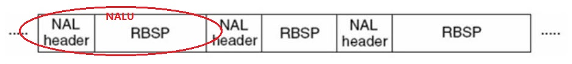
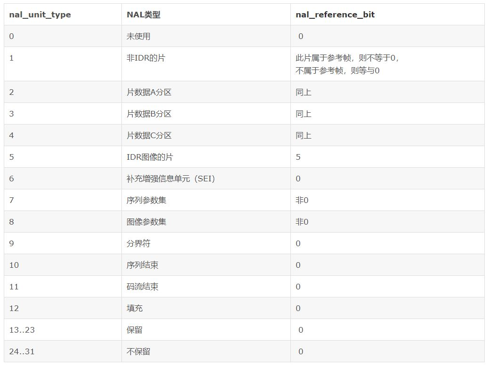
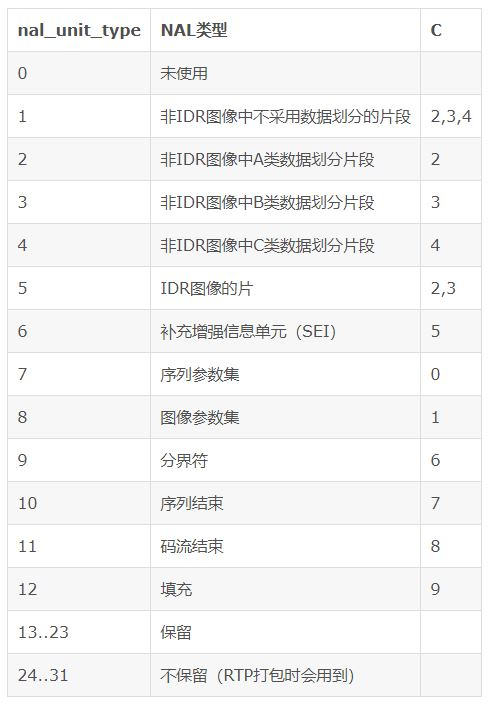
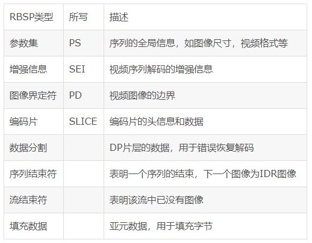
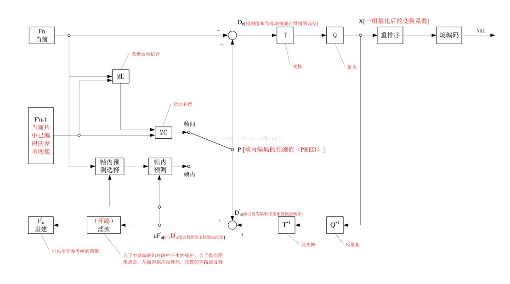

## H.264 原理

#### 1. 名词解释
* 场和帧 (frame) <br>
视频的一场或一帧可用来产生一个编码图像。（包括 I、 P、 B 帧）

* 片 (slice) <br>
片分为 I 片、B 片、P 片和其他一些片。 每个图像中，若干宏块被排列成片的形式。
    * I 片只包含 I 宏块
    * P 片可包含 P 和 I 宏块
    * B 片可包含 B 和 I 宏块

* 宏块 (macroblock) <br>
—— 宏块作为 H264 编码的基本单位 <br>
一个编码图像通常划分成若干宏块组成，一个宏块由一个 16×16 亮度像素和附加的一个 8×8 Cb和一个 8×8 Cr彩色像素块组成（参考 yuv 数据）。

特别说明：
```
▪ 概念从大到小依次如下：
   序列、 图像（大多时候称为帧，包括I,P,B帧）、 片组、 片（包括I,P,B,SP,SI片）、
   NALU、 宏块、 亚宏块、 块、 像素。
▪ 一个视频图像编码后的数据叫做一帧，一帧由一个片（slice）或多个片组成，一个片由一个或多个宏块（MB）组成，
   一个宏块由 16x16 的 yuv 数据组成。 宏块是编码处理的基本单元。
▪ 一幅图像由 1～N 个片组组成，而每一个片组又由一个或若干个片组成，一个片由一个 NALU 或三个 NALU （假如有数据分割） 组成。
   图像解码过程中总是按照片进行解码，然后按照片组将解码宏块重组成图像。从这种意义上讲，片实际是最大的解码单元。
```

##### 1.1 何谓场？
* 每个电视帧都是通过扫描屏幕两次而产生的，第二次扫描的线条刚好填满第一次扫描所留下的缝隙。每个扫描即称为一个场。因此 25 帧/秒的电视画面实际上为 50 场/秒。
* 当计算机显示器播放视频时，它只会显示一系列完整的帧，而不使用交错场的电视技巧。 因此针对计算机显示器所设计的视频格式和 MPEG-1 都不使用场。

原始视频帧（最原始的视频数据）根据编码的需要，以不同的方式进行扫描产生两种视频帧：连续或隔行视频帧。
* 隔行视频帧包括顶场和底场。（场编码）
* 连续（逐行）视频帧。（帧编码）
* 一般情况下，遂行帧进行帧编码，隔行帧可在帧编码和场编码间选取。

```
在帧编码中，参考为帧图像，采用帧运动补偿，两个场是联合编码；
在场编码中，参考为场图像，两个场是分别编码，采用场运动补偿。
```
##### 1.2 图像自适应帧/场编码（PAFF）、 宏块自适应帧/场编码（MBAFF）
##### PAFF
* 对于一个运动图像，由于场之间存在着较大的扫描间隔，所以帧中相邻两行之间的空间相关性相对于场较小，因此对两个场分别编码会更节省码流。
* 对于一个非运动图像，相邻两行之间存在较大的空间相关性，将两场合并为一帧编码更有效。
##### MBAFF
* 当图像同时存在运动区域和非运动区域时，PAFF 的劣势便显现出来，PAFF 的自适应粒度太粗，无法实现满足更加精细的编码要求，于是 MBAFF 应运而生。
* MBAFF 对帧编码或场编码的选择是基于宏块的，MBAFF 将两场合并为一帧进行编码，但将每一个帧宏块 (16x16) 划分为场宏块对 (8*16)，针对每一个帧宏块，比较帧编码和场编码产生的码流大小，使用最节省码流的方式。


#### 2. H.264 编码过程中的三种不同的数据形式
* SODB(数据比特串) <br>
最原始的编码数据，即 VCL 数据。

* RBSP(原始字节序列载荷) <br>
RBSP trailing bits 一个 bit “1” 若干 bit “0”，以便字节对齐。

* EBSP(扩展字节序列载荷) <br>
在 RBSP 基础上填加了仿校验字节。

##### 2.1 H.264 的主要目标
* 高的视频压缩比
* 良好的网络亲和性

##### 2.2 H.264 的解决方案
* VCL(video coding layer) 视频编码层 <br>
VCL 层是对核心算法引擎，块，宏块及片的语法级别的定义，输出编码完的数据 SODB。

* NAL(network abstraction layer) 网络提取层 <br>
NAL 层定义片（slice）级以上的语法级别，如：序列参数集和图像参数集，针对网络传输，用于支持：独立片解码，起始码唯一保证，SEI 以及流格式编码数据传送。
```
▪ NAL 层将 SODB 打包成 RBSP 然后加上 NAL 头，组成一个 NALU（NAL单元）。
▪ 在 NALU 加到 Annexb 上时，需要设置每个 NALU 的开始码 StartCodePrefix。
   如果该 NALU 对应的 slice 为一帧的开始，则用 4 位字节表示（0x00000001），否则用 3 位字节表示（0x000001），以表示是一帧的一部分。
   另外，为了使 NALU 主体中不包含与开始码相冲突的字段，在编码时，每遇到两个字节连续为 0，就插入一个字节的 0x03。 解码时将 0x03 去掉。（“脱壳操作”）
```

##### 2.3 H.264 网络传输的结构

###### NALU 的结构是： NAL 头 + RBSP
<div align="center"></div>

* NALU 头用来标识后面的 RBSP 是什么类型的数据，他是否会被其他帧参考以及网络传输是否有错误。

    * NALU 头结构（1 byte） <br>
    forbidden_bit(1bit) + nal_reference_bit(2bit) + nal_unit_type(5bit)

    * forbidden_bit 禁止位 <br>
    初始为 0，当网络提取层发现 NAL 单元有比特错误时可设置该比特为 1，以便接收方纠错或丢掉该单元。

    * nal_reference_bit NAL 重要性指示 <br>
    标志该 NAL 单元的重要性，值越大，越重要，解码器在解码处理不过来的时候，可以丢掉重要性为 0 的 NALU。
    <div align="center"></div>

    * nal_unit_type NALU类型取值 <br>
    <div align="center"></div>

说明：
* 所谓参考帧，就是在其他帧解码时需要参照的帧。比如一个 I 帧可能被一个或多个 B 帧参考，一个 B 帧可能被某个 P 帧参考。
* DIR 的 I 帧是非常重要的，他一丢，那么这个序列的所有帧都没办法解码了。
* 序列参数集和图像参数集也很重要，没有序列参数集，这个序列的帧就没法解。
* 没有图像参数集，那用到这个图像参数集的帧都没法解。

###### RBSP
* RBSP 数据是下表中的一种
<div align="center"></div>

##### 2.4 数据分割
组成片的编码数据存放在 3 个独立的 DP（数据分割，A、B、C）中，各自包含一个编码片的子集。
* 分割 Ａ 包含片头和片中每个宏块头数据。
* 分割 Ｂ 包含帧内和 SI 片宏块的编码残差数据。
* 分割 C 包含帧间宏块的编码残差数据。
* 每个分割可放在独立的 NAL 单元并独立传输。

##### 2.5 NALU 的顺序要求
H.264/AVC 标准对送到解码器的 NAL 单元顺序是有严格要求的，如果 NAL 单元的顺序是混乱的，必须将其重新依照规范组织后送入解码器，否则解码器不能够正确解码。

##### 2.6 H.264 有两种封装
* 一种是 annexb 模式，传统模式，有 startcode，SPS 和 PPS 是在 ES 中。
* 一种是 mp4 模式，一般 mp4 mkv 会有，没有 startcode，SPS 和 PPS 以及其它信息被封装在 container 中，每一个 frame 前面是这个 frame 的长度。


#### 3. H.264 转码流程
<div align="center"></div>

* 视频描述的是连续的图像的集合。经过大量的统计表明，前后两幅图像中有大量的数据是一样的，也就是存在着冗余数据，那么使用当前图像对前一张图像做“减法”，获得两个图像的“差值”。 即“残差”。
* 残差可以看做是二维数组，即看做是一个二维矩阵。

##### 预测编码
预测编码对应上图中最上面一行的过程，当前帧 Fn 和前一帧 F'n-1 计算出残差 Dn，经过变换 T，经过量化 Q，重新排序之后进行熵编码得到压缩的图像数据。

说明
```
使用一些数学上的方法对矩阵进行变换达到一定的压缩目的，一般我们常用的数学方法是 DCT（离散余弦变换），变换的结果再次进行采样，比如：
例1. DCT 变换结果中的值范围是从 0,1000，那么我们用 0,10 去表示这个范围。这个过程叫做采样。
例2. 比如离散余弦变换后的结果是 {0,200,300,800,801,900,1000}，我们对其进行重新采样之后可以用以下序列替换 {0,2,3,8,8,9,10}。
     这样可以达到压缩的目的。之后再对量化后的序列进行无损压缩（熵编码）。
```

其他概念
* 差分脉冲编码 DPCM
* 运动估计
* 运动表示法
* **块匹配法** — 一般对于包含多个运动物体的景物，实际中普遍采用的方法是把一个图像帧分成多个块，使得在每个区域中的运动可以很好地用一个参数化模型表征。即将图像分成若干个 NxN 块（如：16x16宏块），为每一个块找运动矢量，并进行运动补偿预测编码。
* 亚像素位置内插
* 运动矢量中值预测
* 前帧对应块运动矢量预测
* 变换编码

<br>

##### H.264 绪论入门
refer https://blog.csdn.net/chinadragon76/article/details/22408727

##### x264 源代码分析
请参考系列博客： https://blog.csdn.net/leixiaohua1020/article/details/45536607
