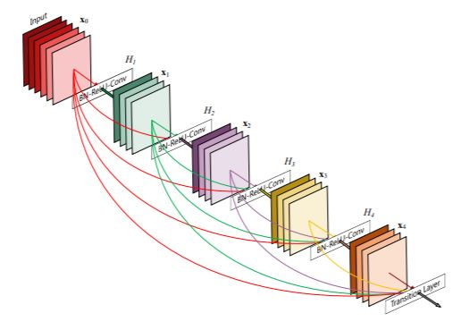
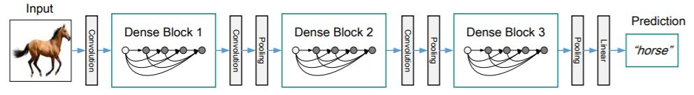
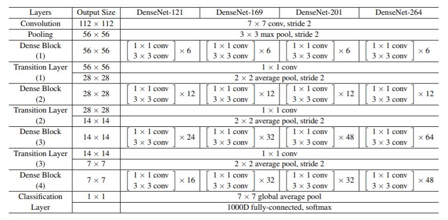
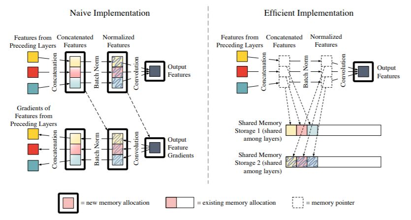

## Memory-Efficient Implementation of DenseNets

##### Abstract （摘要）
* The DenseNet architecture is highly computationally efficient as a result of feature reuse.
However, a naive DenseNet implementation can require a significant amount of GPU memory.
* In this work, we reduce the memory consumption of DenseNets **during training**, by strategically using shared memory allocations.
We reduce the memory cost for storing feature maps from *quadratic*（二次） to *linear*.

##### Prerequisite
###### Dense Block

A 5-layer dense block with a growth rate of k = 4. Each layer takes all preceding feature-maps as input.

###### DenseNet Architecture

A deep DenseNet with three dense blocks. The layers between two adjacent blocks are referred to as transition（过渡） layers and change feature-map sizes via convolution and pooling.

DenseNet architectures for ImageNet. The growth rate for all the networks is k = 32. Note that each “conv” layer shown in the table corresponds the sequence BN-ReLU-Conv.

###### source: Densely Connected Convolutional Networks (Paper)

##### Introduction
The DenseNet architecture is highly efficient, both in terms of parameter use and computation time.
* It is reasonable to expect that larger networks would perform even better. However, with most existing DenseNet implementations, model size is currently limited by GPU memory.
* Each layer only produces k feature maps (where k is small - typically between 12 and 48), but uses all previous feature maps as input.
This causes the number of parameters to grow quadratically with network depth.
* Our primary observation is that -  
  _The intermediate feature maps responsible for（对..有责） most of the memory consumption are relatively cheap to compute. （时空权衡思想）_
* Subsequent layers overwrite the intermediate results of previous layers, but their values can be re-populated（重新入住） during the backward pass at minimal cost.
* This solution adds 15-20% additional training time.

##### 笔记
ImageNet ILSVRC-2012 数据集上，201-layer DenseNet 与 101-layer ResNet 拥有相同的 top-1 分类误差。
* Parameters （参数量） DenseNet 20M vs ResNet 40M。
* Floating Point Operations （浮点操作量） DenseNet 80B/image vs ResNet 155B/image。

##### DenseNet Implementation
###### DenseNet Layer Forward Pass

The efficient implementation stores the output of the concatenation, batch normalization, and ReLU layers in temporary storage buffers, whereas the original implementation allocates new memory.

* Solid Boxes - Allocated memory.
* Translucent（半透明） Boxes - Pointers.
* Solid Arrows - Computation.
* Dotted（虚） Arrows - Memory pointers.

##### Memory-Efficient Implementation
* We exploit that concatenation and normalization operations are computationally extremely cheap.
    * During the forward pass, we assign all intermediate outputs to these memory blocks (Shared Memory Storage).
    * During back-propagation, we recompute the concatenated and normalized features on-the-fly（运行中） as needed.
* Shared Storage for Concatenation - Shared Memory Storage 1.
* Shared Storage for Batch Normalization - Shared Memory Storage 2.
* Shared Storage for Gradients  
    * The concatenation, batch normalization, and convolution operations each produce gradients tensors during back-propagation.
    * In LuaTorch, it is straight forward to ensure that this tensor data is stored in a single shared memory allocation.
    * The PyTorch and MxNet frameworks share gradient storage out-of-the-box（即开即用）.

##### Conclusion 
* The forward pass is similar to the naive implementation. 
* The backward pass requires one additional step:
    * We first re-compute the concatenation and batch normalization operations in order to re-populate the shared memory storage with the appropriate feature map data.
    * Then we can perform regular back-propagation to compute gradients.
