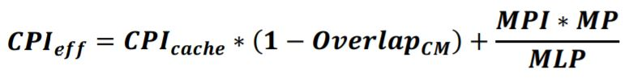

## Quantifying the Performance Impact of Memory Latency and Bandwidth for Big Data Workloads

##### Abstract
* In recent years, DRAM technology improvements have scaled at a much slower pace than processors.  
  ***While server processor core counts grow from 33% to 50% on a yearly cadence, DDR 3/4 memory channel bandwidth has grown at a slower rate,
  and memory latency has remained relatively flat for some time.***
* Combined with new computing paradigms such as big data analytics, which involves analyzing massive volumes of data in real time, there is a
  trend of increasing pressure on the memory subsystem.  
  ***This makes it important for computer architects to understand the sensitivity of the performance of big data workloads to memory bandwidth and latency,
  and how these workloads compare to more conventional workloads.***

**Values:**
* present analytic equations to quantify the impact of memory bandwidth and latency.
* classify different workloads according to their inherent bandwidth requirement and latency sensitivity.

##### Related Work
1. discussing memory system characterization of conventional enterprise workloads. （传统 workloads 的 memory 系统特性）
2. performance analysis of large-scale internet data center workloads. （互联网数据中心）
    * 处理器核心数相关特性
    * 调度策略特性
    * 平台级相关设计特性
3. characterized big data workloads. （Hadoop 集群）
    * 特殊 case 的特性
    * 功耗-性能表现
    * page-table 和 virtual memory 相关优化
    * L1/L2/L3 cache misses 特征
    * 内存使用特征
4. performance modeling. （）
    * data and instruction cache miss rates
    * mask the cost by performing ops in parallel
    * instruction level parallelism
    * estimate performance using CPI
    * memory-level parallelism (MLP)

##### Workloads
* Big Data
    * In-Memory Column Stores
    * Needle(针) In The HayStack(干草堆) (NITS) Search
    * Proximity Search
    * Spark In-Memory Computing
* Enterprise Workloads
    * Online Transaction Processing (OLTP)
    * Java processing (JVM)
    * Virtualized processing (virtualization)
    * Web tier caching (web caching)
* High Performance Computing Workloads (HPC)
    * SPEC CPU2006 SPECfp benchmark suite  
      —— The SPEC CPU2006 benchmarks represent real-world problems of R&D environments or a highly specialized field such as weather forecasting.
* Memory Traffic Characterization
    * Intel Memory Latency Checker

##### METHODOLOGY
##### 1.1 Cycles per Instruction and Pathlength
* number of clock *cycles per instruction* (CPI)
* the required number of instructions to complete a unit of work. (*Pathlength*)   

##### 笔记
***Pathlength*** 取决于软件代码路径，即当前 workload 完整执行需要的指令执行数目。  
论文中的研究针对 fixed workload (fixed pathlength) 和固定核心数量。

##### 1.2 Relating CPI to Memory Behavior
假设前提
* instruction throughput is sensitive to and limited by memory latency. (***memory bound***)

其他可能的极端
* ***core bound*** —— performance is solely limited by the processor issue width and functional units.
* ***bandwidth bound*** —— performance is limited by the maximum amount of memory bandwidth the system can deliver.

简写符号表
* ***CPI*** —— Cycles per instruction.
* ***PL*** —— Pathlength.
* ***CPI_eff*** —— Effective CPI.
* ***CPI_cache*** —— CPI with an infinite cache. （Cache 足够用不存在 Miss。）
* ***MPI*** —— Misses per instruction.
* ***MPKI*** —— Misses per 1000 instructions.
* ***MP*** —— Miss penalty(惩罚), in cycles.
* ***BF*** —— Blocking factor. （percentage of the miss penalty. 用于调整惩罚力度的大小。）
* ***MLP*** —— Memory-level parallelism. （*multiple simultaneous outstanding long latency cache misses.*）
* ***BW*** —— Bandwidth.
* ***WBR*** —— Writeback rate @ cache line evictions(收回).
* ***LS*** —— Line size.
* ***IOPI*** —— I/O events per instruction.
* ***IOSZ*** —— Average size of memory read per I/O event.
* ***CPS*** —— Cycles per second (Core Speed, Hz)
* ***HPC*** —— High performance computing.
* ***NITS*** —— Needle in the haystack queries.

###### single-thread （two-level memory hierarchy） 条件下的 CPI 模型

* ***If an application is truly core bound, it will have no sensitivity to memory latency, and the BF will be 0.***
* ***If the workload is bandwidth bound, the equation should still hold(成立), as queuing theory informs us that latency increases dramatically(显著地) as available bandwidth becomes saturated(饱和的).***

综上，
* MP 即数据从 Memory 到 Cache 的时钟消耗。
* 当 ***core bound*** 时， ***BF*** 设置为 0。
* 当 ***bandwidth bound*** 时， ***BF*** 需要根据实际情况调整，以符合 latency 特性。

##### 笔记
* 单线程、两级内存，即 Memory 之下只有一级 Cache。
* ***CPI_eff*** 即不存在 Cache Miss 理想情况下的 CPI 加上 MPI 乘以 MP，同时乘以一个惩罚力度调整因子 BF。

###### 其他论文中的 CPI 模型

将两个 ***CPI_eff*** 公式联立，可推导出 ***BF*** 的求解公式

结论，
* ***BF*** 与 ***1/MLP*** 成比例。
* ***BF*** 又由 ***Overlap_CM*** 抵消一部分。
* ***Overlap_CM*** —— represents the overlap of core execution with cache misses, and is computed as a fraction of the average miss penalty. (core 执行与 cache miss 的重叠程度)

特别说明
* ***Overlap_CM*** 和 ***MLP*** 不容易直接监测获取。

因此，
* 后面需要考虑如何计算获得 ***BF*** 的值。
* 论文中假设 ***BF*** 是一个常量，因为希望 ***BF*** 计算公式的第二项部分相比第一项 ***1/MLP*** 很小，同时希望当 ***MP*** 增大时该项趋近于 0。

##### 笔记
***CPI_cache*** 不代表没有 ***core stall***。 （*It is possible for data dependencies and serialization events to cause core stalls even when executing with an infinite cache.*）

另外，
* 论文假设 infinite third-level(last-level) cache （LLC），即 L1/L2 的未命中将导致访问 LLC 而导致 stall cycles。
* ***CPI_cache*** 的值通过对 core 进行带有指令跟踪的仿真获得。

##### 1.3 Modeling Bandwidth
