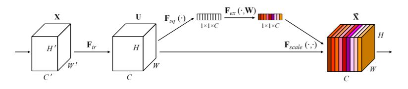
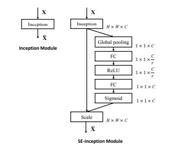
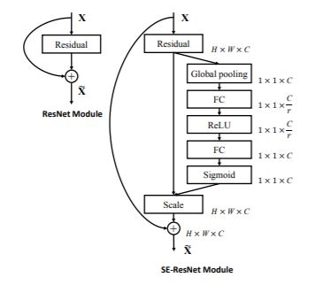
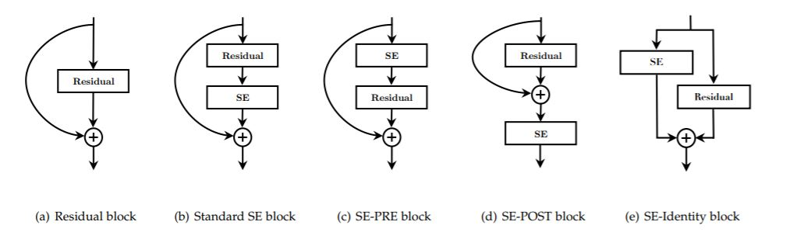
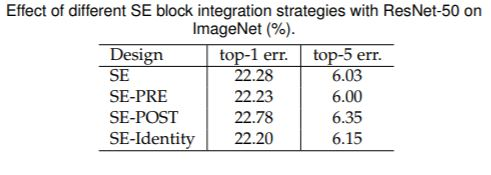

## Squeeze-and-Excitation Networks

##### Abstract (摘要)
* The central building block of convolutional neural networks(CNNs) is the convolution operator, which enables networks to construct informative features by fusing both spatial and channel-wise information within local receptive fields(感受野) at each layer.
* In this work, we focus instead on the channel relationship and propose a novel architectural unit, which we term the "Squeeze-and-Excitation(SE)" block, that adaptively recalibrates channel-wise feature responses by explicitly modeling interdependencies between channels.

##### 笔记
提升 CNN 表达能力的思路：
* 在整个特征层次结构中提高空间编码的质量。
* 图像 channel 之间的相互依赖。

##### Introduction
Recent research has shown that these representations can be strengthened by integrating learning mechanisms into the network that help capture spatial correlations between features.
* One such approach, popularised by the Inception family of architectures, incorporates multi-scale processes into network modules.
* Further work has sought to better model spatial dependencies and incorporate spatial attention into the structure of the network.

In this paper, we investigate a different aspect of network design - the relationship between channels.

###### SE building block

It is possible to construct an SE network (SENet) by simply stacking a collection of SE blocks. Moreover, these SE blocks can also be used as a drop-in replacement for the original block at a range of depths in the network architecture.

##### 笔记
Feature Recalibration（特征重标定）：
* 首先，进行 conv 特征变换: X -> U。
* 其次，将 U 进行 Squeeze 操作。  
（The features U are passed through a squeeze operation, which produces a channel descriptor by aggregating feature maps across their spatial dimensions (H x W). 请参考 tf.reduce_mean 算子的 global_pool 功能。）  
（The function of this descriptor is to produce an embedding of the global distribution of channel-wise feature responses, allowing information from the global receptive filed of the network to be used by all its layers.）
* 然后，将 **F**sq 进行 Excitation 操作。  
（The excitation operation takes the form of a simple self-gating mechanism（自选通机制） that takes the embedding as input and produces a collection of per-channel modulation（调制） weights.）
* 最后，将 Excitation 操作产生的权重作用于特征 U 上，产生 SE 模块的输出特征。  
（These weights are applied to the feature maps U to generate the output of the SE block which can be fed directly into subsequent layers of the network.）

##### Related Work
* Deeper Architecture  
Examples: VGGNets, Inception and ResNet etc.
* Algorithmic Architecture Search  
A search that aims to forgo(放弃) manual architecture design and instead seeks to learn the structure of the network automatically.
Much of the early work in this domain was conducted in the *neuro-evolution* community, which established methods for searching across network topologies with evolutionary methods.
* Attention and Gating Mechanisms  
Attention can be interpreted as a means of biasing the allocation of available computational resources towards the most informative components of a signal.
Concurrent work provides an interesting study into the combined use of spatial and channel attention around convolutional and bottleneck units.

##### Experiments

##### Image Classification - Data Augmentation
* We follow standard practices and perform data augmentation with random cropping to a size of 224x224 pixels (or 299x299 for Inception-ResNet-v2) and perform random horizontal flipping.
* Each input image is normalized through mean RGB-channel subtraction.

##### Training
* We adopt the data balancing strategy described in \[67\] for minibatch sampling.
* All models are trained on our distributed learning system *ROCS* which is designed to handle efficient parallel training of large networks.
* Optimisation is performed using synchronous SGD with momentum 0.9 and a minibatch size of 1024.
* The initial learning rate is set to 0.6 and decreased by a factor of 10 every 30 epochs.
* All models are trained for 100 epochs from scratch, using the weight initialisation strategy described in \[68\].

##### Evaluating
* When evaluating the models we apply centre-cropping, so that 224x224 pixels are cropped from each image, after its shorter edge is first resized to 256. (299x299 from each image whose shorter edge is first resized to 352.)

##### Integration with Modern Architecture
* Inception-ResNet-v2
* ResNeXt (using the setting of 32x4d)

##### Mobile Setting
Consider two representative architectures from the class of mobile-optimised networks.
* MobileNet
* ShuffleNet

##### Ablation Study
* To allow us to study the upper limit of performance for each variant, the learning rate is initialised to 0.1 and training continues until the validation loss plateaus(高原) (rather than continuing for a fixed number of epochs).
* The learning rate is then reduced by a factor of 10 and then this process is repeated (three times in total).

##### Ingeration Strategy
###### Variants

###### The Performance of Each Variant

##### Role of SE Blocks
* Although the proposed SE block has been shown to improve network performance on multiple visual tasks, we would also like to understand the role of the squeeze operation and how the excitation mechanism operates in practice.
* Unfortunately, a rigorous(严格的) theoretical analysis of the representations learned by deep neural networks remains challenging.
* We therefore take an empirical approach to examining the role played by the SE block with the goal of attaining at least a primitive(原始的) understanding of its practical function.
